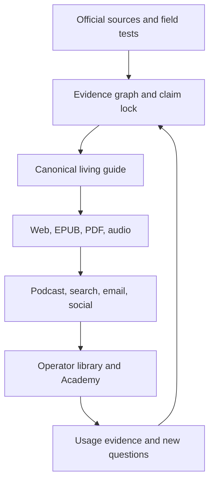

# Starlight Publishing Engine

**The evidence-backed publishing system for human-controlled agentic work.**

This repository is the **strategy, contract-design, and canonical content source** for the Starlight Intelligence Institute publishing system: living guides, field-guide ebooks, podcasts, audiobooks, operator packs, and continuously maintained search authority from one governed research object.

It is not yet the production runtime. The runtime will live in a dedicated `starlight-publishing-os` monorepo after the contracts and first golden release are accepted. Until that extraction, this repository owns ADRs, schemas, fixtures, editorial source, and evaluation assets. The legacy Content Magic workflow is frozen and cannot publish Starlight editions.

## Category position

Starlight does not compete as another AI-news feed or tutorial farm. It owns the layer between product announcements and production operations:

**What changed → which architectural layer changed → what to implement → what it costs → how to verify it.**

## Entity and rights architecture

- **Frank Riemer** — accountable author, host, thesis, judgment, and first-party implementation.
- **Starlight Intelligence Institute** — research and publishing imprint.
- **Legal publisher / rights holder** — recorded separately on every release; the imprint is not assumed to be a legal entity.
- **Starlight Intelligence Systems** — software, plugins, skills, memory, evidence, and agent infrastructure.
- **AI Architect Academy by Starlight Intelligence** — curriculum, cohorts, certification, and team licensing.
- **FrankX** — founder POV and distribution; it links to canonical Starlight objects rather than duplicating them.

Proposed durable URL split, subject to legal/domain confirmation:

- `starlightintelligence.org` — Institute, library, canonical guides, books, reports, and owned RSS.
- `starlightintelligence.ai` — Systems, software, studio, developer documentation, and APIs.

No release can leave staging until `publisher_imprint_id`, `legal_publisher_id`, and `rights_holder_id` are populated.

## One research object, six products

1. Evidence graph and claim lock.
2. Canonical living web guide.
3. PDF and EPUB edition.
4. Podcast or audiobook adaptation.
5. Paid operator pack: repo, skills, prompts, scorecards, and templates.
6. Academy module and team license.

## Contract boundary

The phrase “Edition Object” names a product concept, not one database row or one self-hashing JSON file. Its implementation is deliberately split:

| Contract | Mutability | Purpose |
| --- | --- | --- |
| EditionDraft | Mutable until lock | Editorial identity, intent, authorship, scope, formats, and planned channels |
| ClaimVersion + VerificationEvent | Append-only | Evidence, disputes, re-verification, staleness, and retraction history |
| ReleaseManifestPayload | Immutable | Exact Git state, claims lock, rights, render config, assets, and required destinations |
| ReleaseManifestEnvelope | Immutable | Canonicalized payload plus externally calculated SHA-256 |
| ApprovalEvent | Append-only | Human decision bound to the envelope hash |
| PublicationReceipt | Append-only | Destination response created only after publication |
| WorkflowState | Derived/mutable projection | Current operational state, blockers, attempts, and recovery target |

A manifest never contains its own hash. Approval and receipts never mutate the manifest. A byte change produces a new hash and invalidates prior approval.

## Source-of-truth boundaries

| Domain | Authority |
| --- | --- |
| Prose, diagrams, prompts, schemas, code | GitHub |
| Claims, evidence, workflow events, approvals, metrics | Supabase/Postgres |
| Immutable source and release binaries | Cloudflare R2 |
| Long-running orchestration | Trigger.dev |
| Public library, feeds, studio | Vercel/Next.js |
| Editorial projection | Notion |
| Work projection | Linear |
| Review and partner packets | Google Drive |

Notion, Linear, and Google Drive are projections. They never silently overwrite Git or the evidence graph.

## Initial launch constraint

The first 14 days ship one English field guide, one persistent voice persona, one TTS provider, one owned podcast RSS feed, and one public library page. Multilingual editions, retail audiobooks, automated social posting, and a custom Frank voice clone remain outside launch scope.

## Merge gate for the runtime foundation

The contract-implementation PR that follows this ADR must include:

- separate JSON Schemas for draft, manifest payload, approval event, receipt, and workflow projection;
- deterministic JSON canonicalization and SHA-256 hashing;
- one valid draft fixture and one valid published-release fixture;
- negative fixtures for missing approval, missing audio rights, failed QC, missing receipt, and altered payload;
- AJV validation and hash-tamper tests in required CI;
- Markdown/link/reference checks;
- a golden release whose web, EPUB, PDF, audio, transcript, and receipts share the same content and version IDs.

## Documents

- [Strategy and portfolio](docs/STRATEGY.md)
- [Production architecture](docs/ARCHITECTURE.md)
- [Editorial and release gates](docs/QUALITY-GATES.md)
- [Contract split and invariants](docs/CONTRACTS.md)
- [Edition draft schema](schemas/edition-object.schema.json)

## First canonical releases

1. Graph Engineering for AI Agents
2. Claude Code in Production
3. ChatGPT Work and Codex
4. Agent Loop Engineering — Operator Manual

The operating plan is intentionally narrower than “all AI.” The territory is **human-controlled agentic work**: agent loops, subagents, graph engineering, AI architecture, Claude Code/Cowork, ChatGPT Work/Codex, MCP, skills, memory, evaluation, and the modern AI Center of Excellence.
