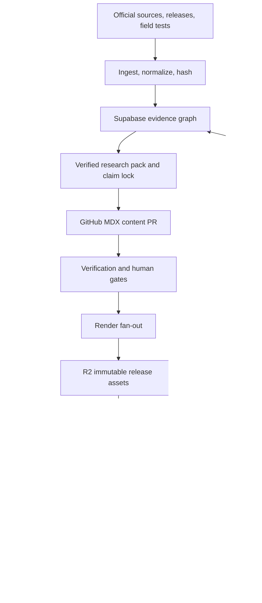

# Starlight Publishing Engine — Production Architecture

## Architectural decision

Build one owned publishing system, not separate ebook, podcast, SEO, and social pipelines.



## Source-of-truth boundaries

Never build round-trip multi-master synchronization.

| Domain | Authoritative system | Ownership |
| --- | --- | --- |
| Authored knowledge | GitHub | MDX prose, diagrams, prompts, render config, schemas, code |
| Structured truth | Supabase/Postgres | Sources, snapshots, claims, entities, graph edges, workflow, approvals, metrics |
| Immutable binaries | Cloudflare R2 | Source snapshots, WAV, MP3/AAC, EPUB, PDF, covers, transcripts |
| Editorial projection | Notion | Readable briefs, catalog, roadmap, editorial calendar |
| Work projection | Linear | Human tasks, blockers, milestones |
| Collaboration/export | Google Drive | Review packets, final plans, partner sharing |
| Runtime presentation | Vercel/Next.js | Public library, studio, RSS, signed downloads, approval APIs |

Every object carries stable content_id, content_version_id, claim_id, release_id, and trace_id. Notion, Linear, and Drive store those IDs and deep links. Edits there do not silently overwrite Git or Supabase.

## Orchestration

Use **Trigger.dev as the sole production orchestrator for the first 12 months**.

- Trigger.dev: research, generation, human waitpoints, queues, retries, rendering, TTS, FFmpeg, audio QC, publication, metrics.
- GitHub Actions: deterministic CI only — schemas, link checks, code tests, EPUB/PDF/RSS validation, preview builds.
- Supabase pgmq: transactional outbox and embedding work only.
- Supabase Cron: housekeeping and freshness scans.
- Vercel Workflow: replacement candidate if consolidation becomes more valuable; never a simultaneous second orchestrator.
- MCP: operator and control interface. Production jobs call stable provider APIs/webhooks.
- n8n/Make: disposable experiments, never canonical workflow state.

Every outbox event uses an idempotency key:

**event_type : content_version_id : target : config_hash**

State and the event are committed in one Postgres transaction. The dispatcher invokes Trigger.dev with at-least-once delivery; idempotency prevents duplicate release effects.

## Evidence graph

Postgres adjacency tables, full-text search, and pgvector are sufficient until measured traversal requirements prove otherwise. Do not introduce Neo4j by aesthetic preference.

### Core objects

| Object | Required data |
| --- | --- |
| sources | canonical URL, publisher, authority tier, source class, license, crawl policy |
| source_snapshots | source ID, fetched/effective time, HTTP metadata, SHA-256, R2 URI, normalized text |
| claims | atomic assertion, kind, subject, scope, temporal class, confidence, status, next review |
| claim_evidence | claim, snapshot, exact locator, stance, excerpt hash |
| entities | Tool, Model, Company, Pattern, Skill, MCP, Benchmark, Standard, Concept |
| edges | typed relationship, provenance, valid-from/to |
| content_items | stable identity, brand, format family, topic, search intent, canonical URL |
| content_versions | semver, Git SHA, source cutoff, claim-set hash, manifest hash, changelog |
| content_claims | content version, block ID, claim ID, narrative role |
| assets | type, locale, content hash, voice/render config, R2 URI, QC status |
| approvals | manifest hash, decision, approver, time, scope |
| publications | target, external ID, canonical URL, receipt, publication time |
| cost_events | provider, model, tokens/characters/minutes, price version, actual cost |
| metric_daily | content, version, channel, intent, metric, value |

Claim kinds:

- fact;
- inference;
- forecast;
- recommendation;
- opinion.

Facts require evidence. Inferences require supporting claims and public labeling. Forecasts require assumptions, horizon, and later scoring.

Temporal classes:

- stable;
- release_bound;
- volatile;
- real_time.

Claim status:

**candidate → verified → disputed → stale → retracted**

Evidence hierarchy:

- Tier 0 — reproduced field test or executable benchmark.
- Tier 1 — official docs, release notes, standards, primary research.
- Tier 2 — authoritative expert analysis.
- Tier 3 — discovery signal only.

AI-generated summaries are never evidence. Writers receive a locked research pack; an independent verifier checks it against primary sources.

## Semantic content source

Use MDX as a semantic document model, not only prose.

- Claim components bind factual sentences to claim IDs.
- Figure components include visual alt text and spoken description.
- Code examples name their executable test.
- Source notes bind sections to source IDs.
- Audio asides express format-specific transitions.
- Exercises become Academy artifacts.

A release freezes:

| Field | Meaning |
| --- | --- |
| schema_version | Contract compatibility |
| content_id | Stable work identity |
| version | Semantic edition version |
| git_sha | Exact authored state |
| source_cutoff_at | Research boundary |
| claim_set_hash | Exact evidence binding |
| prompt_versions | Agent instruction provenance |
| render_config_hash | Exact build configuration |
| voice_persona_id | Governed voice identity |
| rights_manifest_id | Consent/license boundary |
| formats/channels | Required release targets |

Export claims-lock.json for every release so historical editions remain reproducible after live claims change.

## Agent and subagent topology

Agents are permissioned workers with typed outputs.

| Agent | Responsibility | Write boundary |
| --- | --- | --- |
| Radar | Monitor official docs, changelogs, searches, audience questions | Candidate source events |
| Ingestion | Fetch, normalize, deduplicate, hash, classify | Snapshots only |
| Claim compiler | Extract atomic scoped claims | Candidate claims |
| Adversarial verifier | Find contradictions, missing scope, version drift | Claim status only |
| Editorial architect | Thesis, outline, decision model | Opens content branch |
| Chapter subagents | Draft bounded sections from locked packs | Assigned paths only |
| Lab agent | Run code/examples and collect evidence | Sandboxed test artifacts |
| Voice editor | Starlight/Frank voice, compression, anti-slop | Proposed diffs |
| Citation auditor | Check each factual assertion and locator | Release block/approval |
| Narration adapter | Convert approved content to spoken form | Spoken override only |
| Audio producer | Segment, TTS, stitch, master, metadata | Staged assets |
| Release operator | Publish approved manifest | Approved hash only |
| Atomizer | Derivative formats from published source | Cannot introduce claims |
| Search strategist | Query ownership, internal links, cannibalization | Brief/metadata proposals |
| Freshness agent | Detect stale claims and affected releases | Update candidate/Linear issue |

Every subagent receives a bounded task, permitted source/claim IDs, expected schema, cost ceiling, maximum calls, output path, and evaluation rubric.

Use frontier models for thesis, synthesis, adversarial review, and final voice. Use lower-cost models for extraction, classification, metadata, and initial atomization. Use deterministic code for joins, transforms, rendering, and QC.

Crawled content is untrusted data. Research workers cannot execute discovered instructions and have no mutation or publication permissions.

## Human gates

1. **Commission gate** — thesis, audience, commercial role, brand, and search-intent owner.
2. **Evidence-lock gate** — flagship or high-risk content and unresolved contradiction.
3. **Voice gate** — final narrative and human/licensed/clone choice.
4. **Release gate** — exact manifest hash, cover, audio sample, rights, destinations, and offer.
5. **Exception gate** — legal, financial, medical, contentious, or material correction.

Closing a Linear issue is not approval. Approval is a signed studio event bound to the exact manifest hash. Trigger resumes only from that event.

## Release state model

Append-only transitions:

**backlog → brief_approved → evidence_locked → draft_ready → verified → editorial_approved → assets_ready → release_approved → published → monitoring → superseded**

Exceptional states: blocked, failed, withdrawn.

Guards:

- evidence_locked — no unresolved factual contradiction;
- verified — every factual assertion resolves to a verified claim;
- editorial_approved — human approval bound to Git SHA;
- assets_ready — each required format passes its validator;
- release_approved — rights and distribution manifest approved;
- published — mandatory destinations returned receipts and smoke tests passed.

A published version never moves backward. Updates create a new version.

## Ebook and document render

1. Parse MDX into normalized AST.
2. Resolve claims, citations, diagrams, glossary, exercises, and internal links.
3. Render Next.js web, EPUB3, PDF, spoken script, and source-note appendix.
4. Validate schema, citations, code, links, EPUBCheck, font embedding, overflow, accessibility, and rights.
5. Stage immutable assets in R2.
6. Generate semantic and visual diff.
7. Approve exact manifest.
8. Publish aliases and product/download records.

No source dump, audio, PDF, or EPUB binaries live in Git.

## Provider-neutral voice interface

A voice persona belongs to Starlight and maps to provider-specific voice IDs. Editorial content never embeds a vendor voice ID.

Required request fields:

- contentVersionId;
- segmentId;
- normalized text;
- locale;
- voicePersonaId;
- style;
- pronunciationLexiconVersion;
- provider policy: flagship, brief, accessibility.

Voice governance records provider/model mapping, owner and consent, permitted brands/media/territory/term, cloning consent, sample retention, pronunciation lexicon, reference samples, and quality history. Missing or expired rights fail closed.

### Audio pipeline

1. Convert approved chapter to spoken script.
2. Segment on semantic boundaries.
3. Normalize numerals, URLs, acronyms, code, and product names.
4. Apply pronunciation lexicon.
5. Render with provider adapter.
6. Cache by text + voice + model + settings hash.
7. Run ASR round-trip comparison.
8. Flag named-entity and semantic deviations.
9. Detect clipping, silence, discontinuity, repeats, omissions, and order errors.
10. Normalize with format-specific mastering profile.
11. Add licensed intro/outro/music.
12. Generate WAV master, MP3/AAC, transcript, VTT/SRT, chapters, waveform, and ID3.
13. Human-listen to flagged segments plus opening, midpoint, and ending.
14. Bind asset hashes to release manifest.

Podcast and audiobook mastering profiles remain separate.

## Owned publication topology

The permanent Starlight domain owns the podcast RSS. Directories are endpoints.

Two-phase publish:

1. Upload immutable enclosure and verify hash, duration, MIME, byte-range, and public GET/HEAD.
2. Atomically update feed and release alias.

GUIDs are stable and independent of asset URLs. Materially changed episodes receive an update/correction release rather than silent replacement.

Channel model:

- living web — always current;
- free podcast — weekly briefings, selected chapters, update episodes;
- free PDF/EPUB — lead magnets and concise guides;
- paid bundle — full ebook/audiobook/diagrams/templates/update entitlement;
- retail audiobook — stable edition with retailer-specific metadata and eligibility;
- superfan library/private feed — synthesis, source packs, and implementation assets.

## Content atomization

The long-form object owns the thesis. Each derivative inherits the claim lock and has:

- atom_id;
- parent content_version_id;
- distinct intent;
- canonical target;
- source claim IDs.

Satellites must contribute unique evidence, demonstration, or decision logic. No mass-generated thin pages. Syndication is excerpt + canonical link.

## Analytics and freshness

Normalize channels around stable content IDs.

Capture Search Console, site events, audio completion, downloads, email, podcast platforms, YouTube, backlinks, answer-engine citations, product conversion, attributed revenue, provider cost, and returning qualified audience.

Freshness impact:

**source authority × claim volatility × change magnitude × downstream reach × commercial importance**

When a source changes:

1. Store and diff the new snapshot.
2. Identify affected claims.
3. Reverify or mark stale.
4. Traverse content_claims to affected releases and atoms.
5. Create a Linear issue and Git branch.
6. Regenerate invalidated chapters/segments only.
7. Produce semantic and audio diffs.
8. Approve new version.
9. Publish changelog.
10. Measure search, engagement, and conversion recovery.

Semantic versions:

- Patch — correction/source refresh without changed thesis.
- Minor — new section/capability/substantial evidence.
- Major — changed framework, architecture, audience, or promise.

## Repository target

```text
starlight-publishing-os/
├── apps/
│   ├── library/
│   └── studio/
├── content/
│   ├── books/{slug}/
│   ├── series/{slug}/
│   ├── atoms/
│   └── releases/{content_id}/{version}.json
├── packages/
│   ├── contracts/
│   ├── content-ast/
│   ├── evidence/
│   ├── render-web/
│   ├── render-epub/
│   ├── render-pdf/
│   ├── render-audio/
│   ├── tts-adapters/
│   ├── distribution-adapters/
│   ├── analytics/
│   ├── design-system/
│   └── observability/
├── trigger/
│   ├── ingest/
│   ├── research/
│   ├── editorial/
│   ├── render/
│   ├── audio/
│   ├── distribute/
│   └── update/
├── prompts/
├── supabase/
├── tests/
└── .github/workflows/
```

## Observability and SLOs

Every run propagates trace_id, workflow_run_id, content_id, content_version_id, release_id, prompt_version, model/provider, input/output hashes, attempt, latency, and cost.

Alerts:

- stalled approval;
- exhausted retry/dead letter;
- citation or rights failure;
- expected source silence;
- provider spend anomaly;
- RSS/enclosure failure;
- published asset hash mismatch/404;
- missing distribution receipt;
- critical stale claim;
- indexation/ranking regression;
- failed restore test.

Initial SLOs:

- critical source changes detected within 12 hours;
- impacted critical claims assessed within 24 hours;
- zero factual assertions without verified claim binding;
- zero releases without immutable manifest and approval hash;
- rollback to prior web/feed release within 15 minutes;
- all pipeline steps idempotently replayable.

Supabase RLS applies to every exposed table. Authorization lives in trusted metadata. Service-role credentials remain server-only.

## Build vs buy

| Capability | Decision |
| --- | --- |
| Evidence graph, claim ledger, freshness propagation | Build — intellectual moat |
| Editorial studio, manifests, semantic MDX | Build |
| Public library, transcripts, source pages, owned RSS | Build |
| Orchestration | Trigger.dev Cloud initially |
| Database/auth/vector | Supabase |
| Binary/media delivery | R2 |
| TTS/STT | Provider adapters |
| Deterministic audio QC/mastering | Build around FFmpeg/ASR |
| Flagship final mastering | Human/DAW when needed |
| Podcast directories | Free RSS distribution |
| Rank tracking | Buy and combine with Search Console |
| Checkout, tax, retail distribution | Buy |
| Neo4j, Temporal, Kafka | Defer until measured need |

## Primary implementation references

- [Trigger.dev overview](https://trigger.dev/docs/introduction)
- [Trigger.dev waitpoints](https://trigger.dev/docs/wait-for-token)
- [Trigger.dev idempotency](https://trigger.dev/docs/idempotency)
- [Supabase pgvector](https://supabase.com/docs/guides/database/extensions/pgvector)
- [Supabase automatic embeddings](https://supabase.com/docs/guides/ai/automatic-embeddings)
- [Cloudflare R2 S3 API](https://developers.cloudflare.com/r2/api/s3/api/)
- [Cloudflare R2 lifecycle](https://developers.cloudflare.com/r2/buckets/object-lifecycles/)
- [Apple podcast requirements](https://podcasters.apple.com/support/823-podcast-requirements)
- [Spotify external feed submission](https://support.spotify.com/us/creators/article/getting-your-show-on-spotify/)
- [YouTube RSS delivery](https://support.google.com/youtube/answer/13525207)
