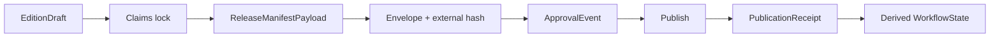

# Contract Split and Machine-Enforced Invariants

## Decision

The business concept **Edition Object** is implemented as a collection of independently governed contracts. Mutable workflow state, immutable release data, human approvals, and post-publication receipts must never share one self-referential payload.



## 1. EditionDraft

Mutable until evidence lock. It contains:

- `content_id`, `content_version_id`, version lineage, locale, and content kind;
- title, subtitle, canonical intent/URL, cluster, and commercial role;
- `author_ids`, `editor_ids`, `publisher_imprint_id`, `legal_publisher_id`, and `rights_holder_id`;
- temporal class, source cutoff, next review, planned formats, and mandatory/optional channels;
- planned narrator/disclosure policy;
- Git branch/path and editorial state.

It does **not** contain a release hash, approval, assets, publication receipts, or final workflow state.

## 2. ClaimVersion and VerificationEvent

Claims are versioned facts, not mutable labels.

`ClaimVersion` contains atomic text, subject, scope, kind, temporal class, confidence, source/evidence links, and validity interval.

`VerificationEvent` is append-only:

- `candidate_created`
- `verified`
- `disputed`
- `stale`
- `reverified`
- `retracted`

The current claim status is derived from the latest valid event. A disputed or stale claim can be reverified without rewriting history.

## 3. ReleaseManifestPayload

Immutable and complete before approval. Required fields:

- schema version, release ID, content/version IDs, prior/superseded version;
- exact Git SHA, source cutoff, claims-lock URI and hash;
- prompt versions and render configuration hash;
- publisher imprint, legal publisher, rights holder, authors, editors;
- locale, content kind, canonical URL;
- required formats and mandatory destinations;
- rights manifest and narrator disclosure;
- every asset's content hash, URI, MIME type, byte size, duration when audio/video, locale, render/voice configuration, and passing QC evidence;
- rollback target;
- build trace and creation time.

It contains no approval, receipt, mutable status, or its own hash.

## 4. ReleaseManifestEnvelope

```json
{
  "payload": { "...": "ReleaseManifestPayload" },
  "manifest_hash": "sha256:<canonical-payload-hash>",
  "canonicalization": "RFC-8785"
}
```

The hash is computed outside the payload from RFC 8785 canonical JSON. Altering one payload byte changes the hash. The envelope is content-addressed and immutable.

## 5. ApprovalEvent

Append-only human judgment containing:

- event ID;
- manifest hash;
- decision: approved, rejected, revoked;
- approver ID and role;
- scope;
- timestamp;
- optional conditions.

Publication refuses if the latest applicable event is not `approved` for the exact hash. Approval of an older hash never transfers.

## 6. PublicationReceipt

Append-only destination evidence created after publication:

- manifest hash;
- target and external ID;
- canonical or destination URL;
- enclosure/content hash;
- published time;
- HTTP/API response evidence;
- smoke-test result;
- attempt and idempotency key.

Replaying the same publish event must produce one logical publication and one effective receipt.

## 7. WorkflowState

A mutable or derived operational projection:

- editorial/release state;
- current blockers;
- active attempt;
- last successful transition;
- recovery or rollback target;
- requested formats and destinations;
- deadlines and owners.

Valid normal path:

`backlog → brief_approved → evidence_locked → draft_ready → verified → editorial_approved → assets_ready → release_approved → published → monitoring → superseded`

Exceptional and recovery events:

- `blocked → resumed`
- `failed → retrying | abandoned`
- `published → withdrawn`
- `published → corrected_by`
- `monitoring → superseded`

A “living” URL is a mutable alias to the latest approved immutable release; it is not a release object that changes in place.

## Application-level invariants

JSON Schema validates shape; application tests enforce cross-object truth:

1. Every factual assertion resolves to a currently verified claim version with an exact immutable locator.
2. No unresolved contradiction exists at evidence lock.
3. Every required format has exactly one passing staged asset.
4. Audio formats require a voice persona, narrator/disclosure metadata, commercial rights, training-data retention/deletion policy when cloned, and passing audio QC.
5. A QC waiver requires reason, scope, approver, timestamp, and exception policy.
6. Release approval matches the exact envelope hash.
7. Every mandatory destination has one effective publication receipt before `published`.
8. Claims-lock, asset, and receipt hashes match stored bytes.
9. Replaying a publish event creates no duplicate destination object.
10. Rollback restores the prior web/feed alias within 15 minutes without deleting evidence.

## Minimum executable fixture suite

### Valid

- early editorial draft with no release-only data;
- final web + EPUB + PDF release;
- final podcast release with licensed voice and passing ASR/audio evidence;
- published multi-channel release with required receipts.

### Invalid

- published release without exact-hash approval;
- audio release without voice rights or disclosure;
- asset with failed QC;
- waived QC without approver/reason;
- required destination without receipt;
- payload altered after approval;
- receipt with enclosure hash mismatch;
- mandatory channel duplicated by idempotent replay.

## Renderer decisions for the pilot

- Web: Next.js/MDX semantic renderer.
- EPUB: Pandoc AST to EPUB3, validated by EPUBCheck.
- PDF: Paged.js/Chromium print pipeline with embedded licensed fonts and page-by-page visual QA.
- Audio: spoken MDX adapter, provider-neutral TTS, FFmpeg mastering, Deepgram ASR round-trip, human listen gate.

These are pilot defaults, recorded in `render_config_hash`; later replacement is allowed only through a new release configuration.

## Outbox and recovery

- Application transaction writes domain event and outbox row together.
- One dispatcher owns delivery to Trigger.dev.
- Idempotency key: `event_type:content_version_id:target:config_hash`.
- Exponential retry has a bounded attempt count.
- Exhausted events move to a dead-letter queue and page the release owner.
- Projection rebuilds consume append-only domain events.
- Publication and rollback operations are safe to replay.

## Legal and identity fields

The imprint, legal publisher, and rights holder are distinct required identities. A provider invoice or voice license does not prove publishing rights. Consent artifacts and voice-clone training material have private storage, retention, access, and deletion rules.

The domain proposal is:

- `starlightintelligence.org` for the Institute, library, reports, books, and RSS;
- `starlightintelligence.ai` for Systems, studio, APIs, and developer assets.

Legal clearance and domain control are explicit pre-launch gates.
